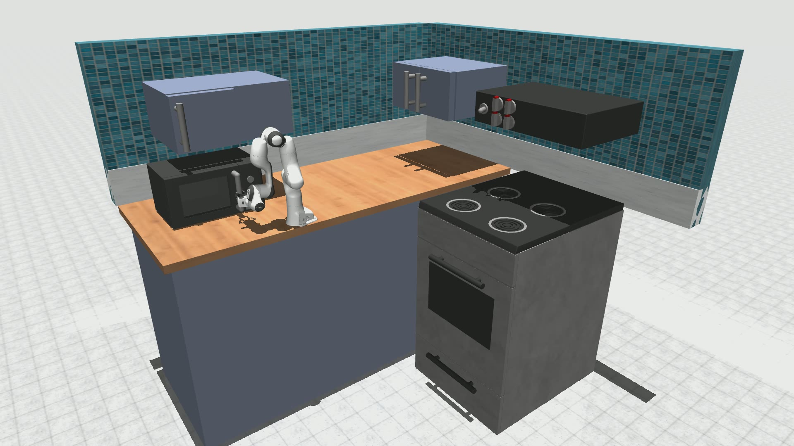

# MetaX Embodied AI Simulation Solution

English | [中文版](README_zh.md)

## About

This solution is designed for the field of embodied intelligence. Leveraging the powerful training and inference capabilities of the **MetaX C500 GPU**, it utilizes the general understanding and reasoning capabilities of LLMs to provide robots with an intelligent "brain". This transforms the traditional manual design pipeline into an actively driven, inference-based process, enabling a fully generative simulation workflow.

We employ LLMs to drive the entire reinforcement learning pipeline in an AI-powered manner, enabling end-to-end automation across a series of steps, including: **task formulation — reward function generation — environment simulation — skill learning**.

We demonstrate our solution using the following kitchen scenario.

Our project is inspired by [RoboGen](https://github.com/Genesis-Embodied-AI/RoboGen).
To achieve better simulation rendering effects, we have migrated the simulation engine from PyBullet to MuJoCo. Meanwhile, we follow the RoboGen workflow for task generation and training.  

Here is a simple operation demo

## Installation

Please refer to [install.md](./docs/install.md) for environment setup.

## Usage

Please refer to [usage.md](./docs/usage.md) for usage.

## Acknowledgements

This project is inspired by [RoboGen](https://github.com/Genesis-Embodied-AI/RoboGen).  

The Franka robotic arm assets and control code used in this project are from [parzivar](https://github.com/parzivar/Franka-Research-3-Robot-Simulation-with-Xbox-Controller-Integration-in-MuJoCo). 

The kitchen assets used in this project are from [franka-kitchen](https://github.com/9mande/franka-kitchen)(unvalid).