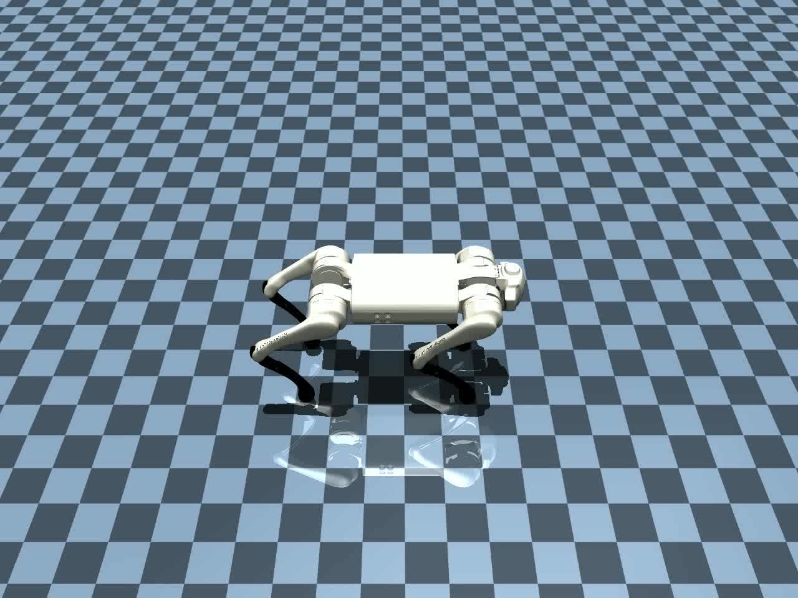

# MetaX Embodied AI Complex Skill Simulation Solution

English | [中文版](README_zh.md)

## About

This solution targets the field of embodied intelligence research. Leveraging the powerful training and inference capabilities of the MetaX C500 GPU and the high-precision simulation environment of MuJoCo, it decomposes complex skills into simple and independent action units to achieve efficient skill transfer and training within MuJoCo. This method provides a feasible and effective best practice for future complex skill training based on MuJoCo or for skill migration from Isaac Gym to MuJoCo.

This approach completes the transfer and training of complex skills in the MuJoCo environment through a four-stage process: asset alignment, API replacement, action adjustment, and motion decomposition. By applying action processing techniques (such as symmetrization and amplitude adjustment), the skill learning process is further accelerated, and the stability and robustness of training are effectively enhanced.

We demonstrate this solution using a quadruped backflip example.

Inspired by [Stage-Wise-CMORL](https://github.com/rllab-snu/Stage-Wise-CMORL). this project migrates the simulation engine from Issac Gym to MuJoCo. Meanwhile, we follow the Stage-Wise-CMORL workflow for training.

Simple visualization showcase

## Installation

Please refer to [install.md](./docs/install.md) for environment setup.

## Usage

Please refer to [usage.md](./docs/usage.md) for usage.

## MuJoCo Migration Notes

Please refer to [migration.md](./docs/migration.md) for migration notes.

## Acknowledgements

This project is inspired by [Stage-Wise-CMORL](https://github.com/rllab-snu/Stage-Wise-CMORL)
