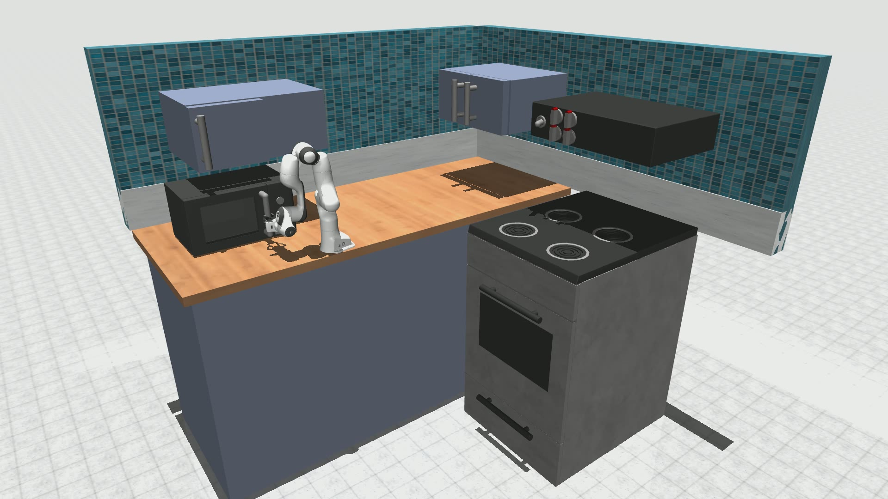

# 沐曦-具身智能仿真解决方案

[英文版](README.md) | 中文版

## 介绍

本方案用于具身智能研究领域，基于沐曦C系列GPU强大的训练推理能力，利用LLM的通用理解与推理能力，赋予机器人智能的大脑，从传统的手动设计流程，变成了主动启发推理，实现全流程的生成式模拟仿真。

我们使用LLM进行强化学习任务的全流程AI驱动，实现端到端自动进行：任务提出 — 奖励函数生成 — 环境仿真 — 技能学习 等一系列步骤。

我们使用如下厨房场景来展示解决方案。

我们的项目受[RoboGen](https://github.com/Genesis-Embodied-AI/RoboGen)启发，为了更好的仿真渲染效果，我们将仿真引擎从PyBullet迁移至MuJoCo，并遵循RogoGen的流程进行任务生成与训练。

一个简单的操作演示：

## 安装

环境安装请参考 [install.md](./docs/install.md)

## 使用 
详细使用方法请参考 [usage.md](./docs/usage.md)

## 致谢

本项目灵感来自 [RoboGen](https://github.com/Genesis-Embodied-AI/RoboGen).  

本项目中使用的Franka机械臂资产与控制代码来自 [parzivar](https://github.com/parzivar/Franka-Research-3-Robot-Simulation-with-Xbox-Controller-Integration-in-MuJoCo). 

本项目中使用的厨房资产来自 [franka-kitchen](https://github.com/9mande/franka-kitchen)（链接已失效）.  